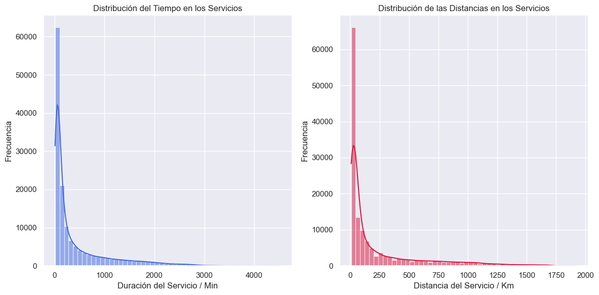

# Delhivery - Análisis de logística y cadena de suministros 
 

## Índice

- [Indice](#indice)
- [Estructura del proyecto](#estructura-del-proyecto)
- [Instalación](#instalación)
- [Acerca del Dataset](#acerca-del-dataset)
- [Librerías y paquetes](#Librerías-y-paquetes)
- [Insights y hallazgos clave](#insights-y-hallazgos-clave)
- [Autor](#Autor)
- [Licencia](#licencia)

  ## Estructura del proyecto

- `data/`: Conjunto de datos de Delhvery.
- `notebooks/`: Análisis en Jupyter Notebooks.
- `output/`: Resultados y visualizaciones.

## Instalación
```bash
   git clone https://github.com/luroel/Deep-Dive-Delhivery.git
```

## Acerca del Dataset
Delhivery es una destacada empresa hindú de cadena de suministros y servicios logísticos, conocida por su amplio alcance y soluciones de entrega eficientes. Delhvery utiliza tecnología sofisticada para ofrecer servicios logísticos integrales, garantizando entregas puntuales y confiables en diversas regiones de la India.


#### Potenciales casos de uso
El análisis de este conjunto de datos ofrece valiosos conocimientos sobre las operaciones logísticas de Delhivery, revelando detalles sobre la eficiencia de los viajes, la optimización de rutas, los tipos de transporte y el desempeño de las entregas.
Permite una comprensión integral de cómo se programan y ejecutan los viajes, cómo diferentes factores afectan los tiempos de entrega, y cómo se optimizan las rutas utilizando motores de enrutamiento de código abierto.
Este extenso conjunto de datos es un recurso valioso para mejorar las estrategias logísticas, mejorar el rendimiento de las entregas y tomar decisiones informadas en la gestión de la cadena de suministro.

#### Cómo se puede aportar
Asistir en la comprensión y procesamiento de datos de sus pipelines de ingeniería:
- Limpieza y manipulación de datos: Limpiar, sanitizar y manipular los datos para extraer características útiles a partir de campos en bruto.
- Interpretación y análisis de datos: Analizar datos sin procesar para apoyar al equipo de ciencia de datos en la construcción de modelos de pronóstico precisos.

#### Perfilado de las columnas
Este conjunto de datos se centra en las operaciones de Delhivery, proporcionando información detallada sobre los viajes y las entregas. Incluye datos de las fases de prueba y entrenamiento, marcas de tiempo de la creación de los viajes, identificadores únicos para los horarios de las rutas y los viajes, tipos de transporte, detalles de carga completa de camiones, información de acarreos, detalles de origen y destino, horas de inicio y fin de los viajes, tiempos de entrega, distancias y varios campos desconocidos que podrían proporcionar información adicional tras un análisis más profundo.

## Librerías y paquetes
``` python
import pandas as pd
import numpy as np
import seaborn as sns
import matplotlib.pyplot as plt
from geopy.geocoders import Nominatim
import time
import folium
from sklearn.cluster import KMeans
import plotly.express as px
import plotly.graph_objects as go 
import googlemaps
from datetime import datetime
``` 

## Insights y hallazgos clave
1. ### Canitidad de servicios por tipo de ruta

 

2. ### Frecuencia del tiempo y la distancia del trayecto del servicio



3. ### Relación entre la Distancia y el tiempo actual en el Recorrido


4. ### Impacto del tipo de ruta en el tiempo actual de duración del recorrido


5. ### Análisis exploratorio de la ruta Carting


6. ### Análisis exploratorio de la ruta FTL


### Evaluación de la eficiencia en rutas y servicios

7. #### Distribuciones en la evaluación de la eficiencia de las rutas


8. #### Impacto del Cutoff en la duración de los servicios


9. #### Distribución de rutas ineficientes por días de la semana


10. #### Tiempo actual  promedio por estado y diferencia de tiempo por estado en función del actual y el OSRM


11. #### Tiempo actual promedio del servicio por tipo de ruta y diferencia entre el tiempo real y el OSRM por tipo de ruta


12. #### Tiempo actual promedio por fecha y diferencia entre el tiempo actual y el OSRM por fecha


## Autor
Luis Rodríguez Elías


## Licencia

## Contribuciones

Guía para contribuir al proyecto.

## Licencia

Información sobre la licencia del proyecto.
