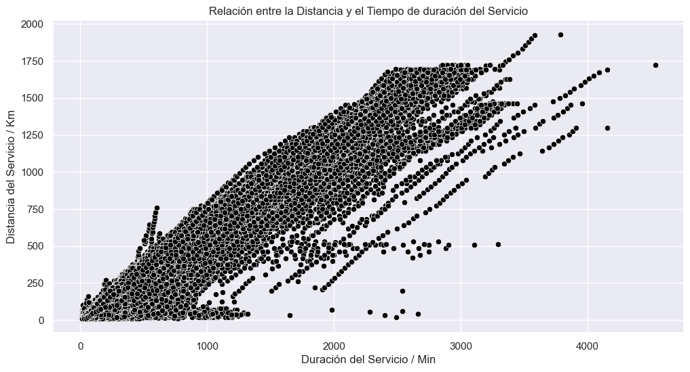
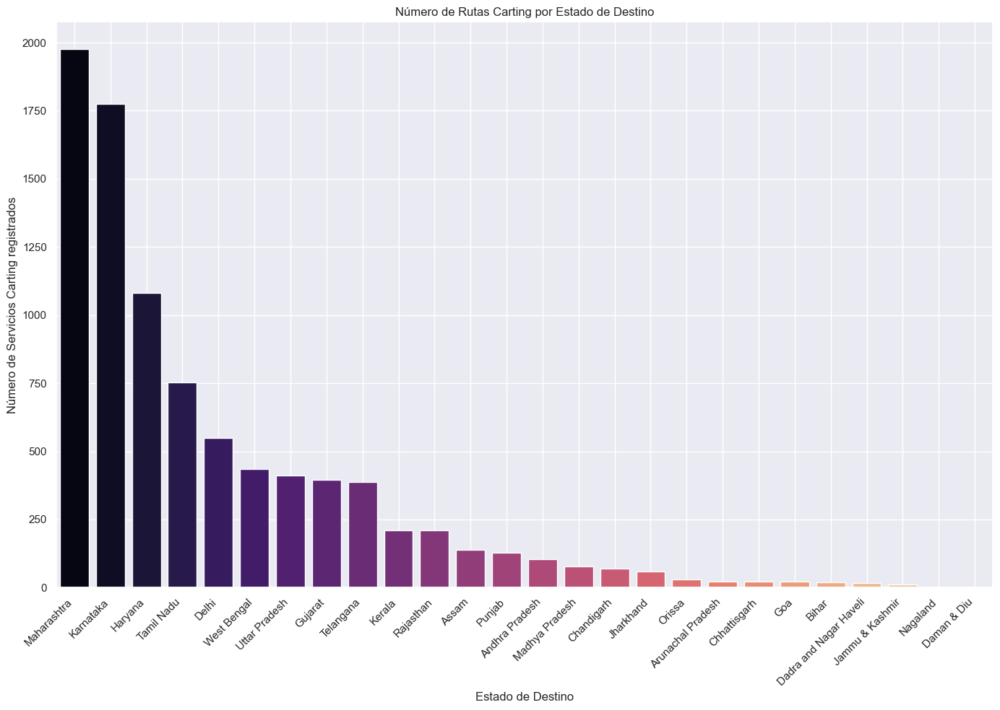
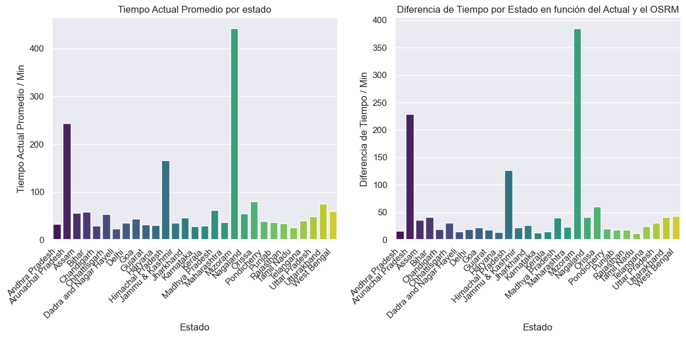

# Delhivery - Análisis de logística y cadena de suministros 
 

## Índice

- [Indice](#indice)
- [Estructura del proyecto](#estructura-del-proyecto)
- [Instalación](#instalación)
- [Acerca del Dataset](#acerca-del-dataset)
- [Librerías y paquetes](#Librerías-y-paquetes)
- [Insights y hallazgos clave](#insights-y-hallazgos-clave)
- [Acciones tomadas para la limpieza de datos e ingeniería de características](#acciones-tomadas-para-la-limpieza-de-datos-y-la-ingeniería-de-características)
- [Machine learning](#machine-learning)
- [Resumen del conjunto de datos](#resumen-del-conjunto-de-datos)
- [Autor](#Autor)
- [Licencia](#licencia)

  ## Estructura del proyecto

- `data/`: Conjunto de datos de Delhvery.
- `notebooks/`: Análisis en Jupyter Notebooks.
- `output/`: Resultados y visualizaciones.

## Instalación
```bash
   git clone https://github.com/luroel/Deep-Dive-Delhivery.git
```

## Acerca del Dataset
Delhivery es una destacada empresa hindú de cadena de suministros y servicios logísticos, conocida por su amplio alcance y soluciones de entrega eficientes. Delhvery utiliza tecnología sofisticada para ofrecer servicios logísticos integrales, garantizando entregas puntuales y confiables en diversas regiones de la India.


#### Potenciales casos de uso
El análisis de este conjunto de datos ofrece valiosos conocimientos sobre las operaciones logísticas de la empresa, revelando detalles sobre la eficiencia de los viajes, la optimización de rutas, los tipos de transporte y el desempeño de las entregas.

Permite una comprensión integral de cómo se programan y ejecutan los viajes, cómo diferentes factores afectan los tiempos de entrega, y cómo se optimizan las rutas utilizando motores de enrutamiento de código abierto.

Este extenso conjunto de datos es un recurso valioso para mejorar las estrategias logísticas y mejorar el rendimiento de las entregas y tomar decisiones informadas en la gestión de la cadena de suministro.

#### Cómo se puede aportar
Asistir en el desglose y tratamiento de los datos en pipelines de ingeniería:
- Limpieza y manipulación de datos: Limpiar, sintetizar y manipular los datos para extraer características útiles a partir de campos en bruto.
- Interpretación y análisis de datos: Analizar datos sin procesar para apoyar al equipo de ciencia de datos en la construcción de modelos de pronóstico precisos.

#### Perfilado de las columnas
Este conjunto de datos se centra en las operaciones de Delhivery, proporcionando información detallada sobre los viajes y las entregas. Incluye datos de las fases de prueba y entrenamiento, marcas de tiempo de la creación de los viajes, identificadores únicos para los horarios de las rutas y los viajes, tipos de transporte, detalles de carga completa de camiones, información de recolecciones, detalles de origen y destino, horas de inicio y fin de los viajes, tiempos de entrega, distancias y varios campos desconocidos que podrían proporcionar información adicional tras un análisis más profundo.

## Librerías y paquetes
``` python
import pandas as pd
import numpy as np
import seaborn as sns
import matplotlib.pyplot as plt
from geopy.geocoders import Nominatim
import time
import folium
from sklearn.cluster import KMeans
import plotly.express as px
import plotly.graph_objects as go 
import googlemaps
from datetime import datetime
``` 

## Insights y hallazgos clave
1. ### Canitidad de servicios por tipo de ruta

 

2. ### Distribución del tiempo y las distancias del servicio


3. ### Relación entre la Distancia y el tiempo actual en el Recorrido



4. ### Impacto del tipo de ruta en el tiempo actual de duración del recorrido


5. ### Análisis exploratorio de la ruta Carting



6. ### Análisis exploratorio de la ruta FTL


### Evaluación de la eficiencia en rutas y servicios

7. #### Distribuciones en la evaluación de la eficiencia de las rutas


8. #### Impacto del Cutoff en la duración de los servicios


9. #### Distribución de rutas ineficientes por días de la semana


10. #### Tiempo actual  promedio por estado y diferencia de tiempo por estado en función del actual y el OSRM



11. #### Tiempo actual promedio del servicio por tipo de ruta y diferencia entre el tiempo real y el OSRM por tipo de ruta


12. #### Tiempo actual promedio por fecha y diferencia entre el tiempo actual y el OSRM por fecha


#### Distribución de los datos
- Muchas características muestran distribuciones sesgadas hacia la derecha, particularmente las variables relacionadas con el tiempo y la distancia.

#### Correlaciones:
	Se observaron: 
  - correlaciones positivas entre el tiempo actual, la distancia actual al destino.
  - el tiempo OSRM y las características relacionadas con la distancia.
	- Impacto tiempo actual en relación al cutoff factor. 

#### Valores Atípicos:
	- Presencia de valores atípicos en varias características, especialmente en las variables de tiempo y distancia.
	- Algunos valores extremos pueden representar viajes inusuales o errores en la recopilación de datos.
  - Valores nulos presentes en las variables source_name y destination_name.

#### Importancia de las características:
	- Se seleccionaron características con ratio mayor a 1 con 'segment_actual_time' y 'segment_osrm_time' para el modelo de eficiencia.
	- Las características predictivas clave probablemente incluyen estimaciones de OSRM, distancias y factores derivados.

#### Variables Categóricas:
	- Se codificaron características categóricas como 'route_type', 'source_name', 'destination_name' y 'od_start_time' principalmente.
	
  Estas proporcionan información valiosa sobre las características y patrones de los viajes.

#### Patrones Basados en el Tiempo:
	- Posibilidad de análisis basado en el tiempo utilizando 'initial_format_date', 'initial_format_time' y otras características temporales.
	- Patrones en el tráfico o la demanda a lo largo del día/semana.

#### Consideraciones para el Modelo:
	- Dada la presencia de valores atípicos y distribuciones sesgadas, podrían ser adecuados modelos robustos o no paramétricos.
	- La ingeniería de características, como la creación de términos de interacción o características basadas en el tiempo, podría mejorar el rendimiento del modelo.

#### Calidad de los Datos:
	- Algunos valores negativos en las diferencias de tiempo (por ejemplo, ‘tiempo_real_segmento’) sugieren posibles problemas de calidad de los datos.
	-	Puede ser necesario investigar y limpiar estas anomalías.

#### Acciones escalables:
	-	Desarrollar modelos separados para diferentes tipos de rutas o períodos de tiempo para capturar patrones específicos.
	-	Incorporar datos externos (por ejemplo, clima, eventos) para explicar los valores atípicos y mejorar las predicciones.
	-	Implementar una estrategia robusta de detección y manejo de valores atípicos en el proceso del modelo.
	-	Considerar el uso de Machine Learning para capturar relaciones complejas en los datos.

## Acciones tomadas para la limpieza de datos e ingeniería de características

#### Manejo de valores atípicos:
- Eliminación de las filas con valores Null ó nulos.
- El resultado fue un conjunto de datos reducido (df).
- Se reinicio el índice de los valores.

#### Asimetría y normalización de datos
- Se calculó y visualizó la asimetría antes y después de la eliminación de valores atípicos.
- Agrupación del dataframe por valores con un identificador único. 
- Definición de columnas numéricas y categóricas en función del primer valor, el promedio y la sumatoria de sus valores.

#### Extracción de características basadas en el tipo de ruta:
- Extracción de la cantidad de servicios tipo Carting y FTL.
- Densidad de servicios Carting en destino.
- Cantidad de servicios FTL en función del estado de origen y destino.
- Adquisición de coordenadas por medio de la consulta de una API para identificar patrones entre los estados y los tipos de ruta.

#### Extracción de características basadas en el tiempo:
- Se convirtieron las columnas 'od_start_time' y 'od_end_time' al formato datetime.
- Se extrajeron la hora, el nombre del día y el nombre del mes de las variables anteriores.
- Medición del cutoff factor en el tiempo actual.
- Distribución de rutas ineficientes por día de la semana.

#### Creación de características de relación:
- 'efficiency_threshold' 
- 'efficiency': 'segment_actual_time'/'segment_osrm_time'
- 'inefficient_data': 'efficiency' > 'efficiency_threshold'

#### Próximos pasos potenciales:
	- Manejar la asimetría restante mediante transformaciones (por ejemplo, logarítmica, raíz cuadrada).
	- Codificar las variables categóricas.
	- Normalizar o estandarizar las características numéricas.
	- Selección de características basada en análisis de correlación.

## Machine Learning

Elección y manejo del modelo de aprendizaje NO supervisado de Machine Learning <a href="https://d1wqtxts1xzle7.cloudfront.net/89508442/51932-libre.pdf?1660283835=&response-content-disposition=inline%3B+filename%3DK_Means_Algorithm_for_Clustering_of_Lear.pdf&Expires=1727294244&Signature=JpWlwmnGHbrM5t~ylC8GnytWaZ48lQexJO9PSPWLHYjegq7P3HyxUNJkoCAHabfg8EHLEwUwQNKFldBXlI1-TbBuCf~2JTSTqK7H1R9SRp5y1Sbt29ciw2q5hpiO2Z46PIIHYvA~GWKBghs0MvyaktDNaWyKaarCdZfkl7EHhtAiXGNhXb8Tn5jHi-PWQLkj6ct7sAyPpElBJzmIqbQU8xKxIwl8miqVNTkEydnk~RMpmQMctLCwFBZbM8WvJmDwLE~Ui3PXYm0zo503U2NDQS-NWzg-mKSrjJPxYhTs2idubqDMxmKUWv7gfiIG43DyAn-9o8xFtTu70FHCefneFw__&Key-Pair-Id=APKAJLOHF5GGSLRBV4ZA">K-Means</a>


## Resumen del conjunto de datos
La calidad de este conjunto de datos puede considerarse buena, con un tamaño muestra de alrededor de 145,000 registros y una amplia gama de características.

Los datos están bien estructurados y limpios, sin errores ó inconsistencias relevantes. 

Para mejorar aún más el análisis y el modelado, se debería considerar incluir datos relacionados a otros factores externos que puedan influir en el tiempo de entrega, como los patrones de tráfico, el cierre de carreteras, y aunque es un poco complicado trabajar con variables de clima por su amplío espectro de factores que impiden tener una predicción certera, contar con datos de las condiciones meteorológicas.

Estos datos adicionales pueden contribuir de manera notoria en el aumento de la precisión en las predicciones y la comprensión integral de los factores comunes que afectan los tiempos de entrega de la empresa.

## Autor
Luis Rodríguez Elías


## Licencia

## Contribuciones

Guía para contribuir al proyecto.

## Licencia

Información sobre la licencia del proyecto.
